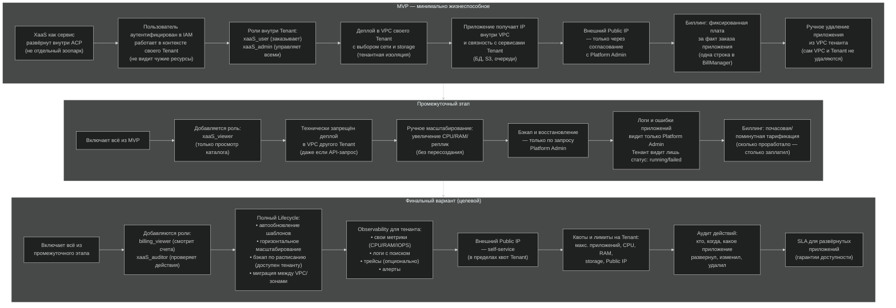

### MVP
| Блок                       | Что значит для человека без контекста                                                    |
| -------------------------- | ---------------------------------------------------------------------------------------- |
| XaaS как сервис внутри ACP | Магазин приложений — не отдельная установка, а встроенный компонент платформы            |
| IAM + контекст Tenant      | Пользователь залогинился и работает только в своем тенанте, чужие не видит               |
| Роли user/admin            | User — заказывает приложения. Admin — может удалить любое приложение тенанта             |
| Деплой в VPC своего Tenant | Приложение ставится в выделенную сеть тенанта, с выбором хранилища                       |
| IP внутри VPC              | Приложение получает адрес, по которому с ним могут общаться другие сервисы тенанта       |
| Внешний IP — через Admin   | Если приложению нужен доступ из интернета — только с разрешения администратора платформы |
| Биллинг фикс               | За факт заказа — одна сумма. Хоть 1 час, хоть месяц — цена та же                         |
| Ручное удаление            | Убрать приложение может пользователь или админ. VPC и тенант остаются                    |
### Промежуточный
| Блок                      | Что значит                                                                                     |
| ------------------------- | ---------------------------------------------------------------------------------------------- |
| + роль viewer             | Можно посмотреть, какие приложения есть в магазине, но заказать нельзя                         |
| Запрет деплоя в чужой VPC | Даже если хакер подделает запрос — система не даст поставить приложение в сеть другого клиента |
| Ручное масштабирование    | Если приложению стало мало ресурсов — увеличиваешь CPU/RAM без переустановки                   |
| Бэкап — только Admin      | Администратор платформы может сделать копию приложения. Тенант сам — пока нет                  |
| Логи — только Admin       | Тенант видит только работает приложение или упало. Детали ошибок — только у администратора     |
| Биллинг почасовой         | Плата идёт за каждый час работы приложения (выгодно, если ставишь ненадолго)                   ||

### Финальный
| Блок                           | Что значит                                                                                         |
| ------------------------------ | -------------------------------------------------------------------------------------------------- |
| + роли billing_viewer, auditor | Можно смотреть счета и проверять, кто что делал                                                    |
| Полный lifecycle               | Приложение можно обновлять автоматически, копировать по расписанию, переносить в другой VPC        |
| Observability                  | Тенант видит графики нагрузки, читает логи, может настроить уведомления (например, если CPU > 80%) |
| Public IP — self-service       | Клиент может сам получить внешний адрес, но в рамках квоты (макс. 5 штук)                          |
| Квоты                          | Не дают одному тенанту сожрать все ресурсы платформы                                               |
| Аудит                          | Журнал: кто и когда что сделал. Нужен для расследований и комплаенса                               |
| SLA                            | Платформа обещает, что приложение будет доступно 99.9% времени                                     ||